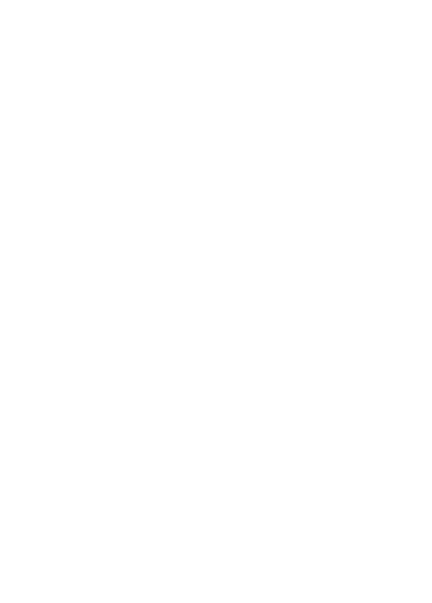

<!-- .slide: data-background="./images/akshar-dave-1GRvY9WUu08-unsplash.jpg" -->
<h1 class="title" style="text-align:left;">Serverless <span class="translucent">Functions +</span> Netlify</h1>
<h2 class="subtitle" style="color:#333;text-align:left;">Sia Karamalegos</h2>

---

## hi, i'm sia

[sia.codes](https://sia.codes/)


---

## [projects.sia.codes/serverless-netlify-talk/](https://projects.sia.codes/serverless-netlify-talk/)

---

## Show + Tell

Astronomic Birthdays 👩🏼‍🚀🚀🎂

[astrobirthday.netlify.app/](https://astrobirthday.netlify.app/)

Note: Show and demo site with. Point out that it's completely static with a serverless function - I securely request from an API with a key that cannot be snooped  , and to re-deploy I only push my code to Github.

---

## Serverless Architecture

&nbsp;

<div class="align-left">
  <p class="fragment fade-in-then-semi-out"><span class="icons"><i class="fas fa-function"></i></span> Applications are broken up into individual functions </p>
  <p class="fragment fade-in-then-semi-out"><span class="icons"><i class="far fa-cloud-upload-alt"></i></span> Hosted by a 3rd party service </p>
  <p class="fragment fade-in-then-semi-out"><span class="icons"><i class="far fa-chart-line"></i></span> Can be invoked and scaled individually </p>
  <p class="fragment fade-in-then-semi-out"><span class="icons"><i class="far fa-server"></i></span> No need for server management by the developer</p>
</div>

&nbsp;

<small>[Serverless Architecture](https://www.twilio.com/docs/glossary/what-is-serverless-architecture)</small>

---

<!-- .slide: data-background="./images/duotone-yell.jpg" class="dark-highlight-quote" -->

## Jamstack <!-- .element: class="dark-background" -->

> A modern web development architecture based on client-side JavaScript, reusable APIs, and prebuilt Markup <!-- .element: class="dark-background" -->

<small class="dark-background">— Mathias Biilmann (CEO & Co-founder of Netlify) [jamstack.wtf](https://jamstack.wtf/)</small>

---


<small>[www.netlify.com/jamstack/](https://www.netlify.com/jamstack/)</small>

Note: Step 1 is to decouple the frontend from the backend. The APIs can be from many sources - like a CMS, Stripe, Square, Auth0, FaunaDB, Hasura Cloud, etc.

---

## Prebuild static pages for speed

<div class="logo-grid">
  
  
  
  
  
  
</div>

Note: you can also use vanilla html, css, and javascript.

---

## Why I ♥️ Netlify

Note: Ask how many have used it - write in chat. Also write what your favorite feature is. My loves: it's just so freaking easy. Deploy with simple "git push" and can run code for builds so you don't have to do it locally first, shows old version if build fails, PR deploy previews, super easy basic forms, automatic HTTPS/SSL, CDN/edge deployments automatic, automatic Brotli compression, handle redirects. This is all before I started using it for serverless functions.

---

## Hello, Netlify

Note: Now we're going to put it on steroids to make it even more powerful.

---

<!-- .slide: data-background="./images/balloon-feet.jpg" -->

# Netlify CLI <!-- .element: style="color:#fff;" -->

<small class="highlighter-light">[Get started with Netlify CLI](https://docs.netlify.com/cli/get-started/)</small>

Note: Netlify CLI lets us more easily build serverless functions in a dev environment and then port them to productions. We can also do other things like easily manage secrets between both environments.

---

<!-- .slide: data-background="./images/bucography-r7eBv7pnP2E-unsplash.jpg" -->

# Environment<br> Variables <!-- .element: class="text-left color-secondary" -->

---

## Keeping secrets secret 🕵🏻‍♀️

---

<!-- .slide: data-background="./images/duotone-babies.jpg" -->

# Serverless Functions <!-- .element: style="color:#fff;" -->

---

## Netlify Functions

<div class="align-left">
  <p class="fragment fade-in-then-semi-out"><span class="icons"><i class="fab fa-aws"></i></span> Uses AWS serverless Lambda under the hood</p>
  <p class="fragment fade-in-then-semi-out"><span class="icons"><i class="far fa-code-merge"></i></span> Version-controlled, built, and deployed with your site</p>
  <p class="fragment fade-in-then-semi-out"><span class="icons"><i class="far fa-binoculars"></i></span> Automatic service discovery (for Deploy Previews and rollbacks)</p>
  <p class="fragment fade-in-then-semi-out"><span class="icons"><i class="fab fa-js"></i></span> JavaScript and Go both supported</p>
</div>

<small>[Netlify functions overview](https://docs.netlify.com/functions/overview/)</small>

---

## <span class="icons"><i class="far fa-sack-dollar"></i></span> Free Tier <span class="icons"><i class="far fa-sack-dollar"></i></span>

- Receive up to 125K function endpoint requests per month
- Use up to 100 hours of function run time per month

<small>[Netlify Pricing](https://www.netlify.com/pricing/)</small>

---

## netlify.toml

```toml
[build]
  command = "npm run build"
  publish = "_site"
  functions = "functions"
```

<small>[File-based configuration](https://docs.netlify.com/configure-builds/file-based-configuration/)</small>

Note: First, we need to tell Netlify where to look for our functions. This will now sync our settings and point to where the functions can be found in our project.

---

<p class="text-left"><span class="icons"><i class="fas fa-pencil"></i></span> Write functions in <strong>/functions/hello.js</strong>.</p>
<p class="text-left"><span class="icons"><i class="far fa-code"></i></span> Access functions via <strong>/.netlify/functions/hello</strong>.</p>

---

```js
// What's in the event parameter?
{
    "path": "Path parameter",
    "httpMethod": "Incoming request's method name"
    "headers": {Incoming request headers}
    "queryStringParameters": {query string parameters }
    "body": "A JSON string of the request payload."
    "isBase64Encoded": "A boolean flag to indicate if the applicable
      request payload is Base64-encode"
}
```

Note: The context parameter includes information about the context in which the serverless function was called, like certain Identity user information, for example.

---

```javascript
// What you can return from your serverless function:
{
    "isBase64Encoded": true|false,
    "statusCode": httpStatusCode,
    "headers": { "headerName": "headerValue", ... },
    "multiValueHeaders": { "headerName": ["headerValue", "headerValue2", ...], ... },
    "body": "..."
}
```

---

<!-- .slide: data-background="./images/duotone-road.jpg" -->

# Bringing it all together <!-- .element: class="dark-background" -->

---

<!-- .slide: data-background="./images/akshar-dave-1GRvY9WUu08-unsplash.jpg" -->
<h1 class="title" style="text-align:left;">Thanks!</h1>

<p style="color:#333;text-align:left;">Slides:<br> <a href="https://projects.sia.codes/serverless-netlify-talk/" class="link-secondary">projects.sia.codes/serverless-netlify-talk/</a></p>
<p style="color:#333;text-align:left;">Demo:<br> <a href="https://github.com/siakaramalegos/serverless-netlify-demo" class="link-secondary">bit.ly/yo-serverless</a></p>
<p style="color:#333;text-align:left;">Writing, resources, and more:<br> <a href="https://sia.codes/" class="link-secondary">sia.codes</a></p>

---

## Photo credits

- Road possum - Image by <a href="https://pixabay.com/users/csbonawitz-10920947/?utm_source=link-attribution&amp;utm_medium=referral&amp;utm_campaign=image&amp;utm_content=3861107">csbonawitz</a> from <a href="https://pixabay.com/?utm_source=link-attribution&amp;utm_medium=referral&amp;utm_campaign=image&amp;utm_content=3861107">Pixabay</a>
- Hissing possum - Image by <a href="https://pixabay.com/users/xandepontes-13842118/?utm_source=link-attribution&amp;utm_medium=referral&amp;utm_campaign=image&amp;utm_content=4787791">Alexandre Pontes Gomes xande</a> from <a href="https://pixabay.com/?utm_source=link-attribution&amp;utm_medium=referral&amp;utm_campaign=image&amp;utm_content=4787791">Pixabay</a>
- Snow possum - [University of Texas biodiversity blog](https://biodiversity.utexas.edu/news/entry/campus-biodiversity-awesome-opossums)
- Possum with babies - [Wikimedia Commons](https://commons.wikimedia.org/wiki/File:Didelphis_virginiana_with_young.JPG)
- Balloons <span>Photo by <a href="https://unsplash.com/@buco_balkanessi?utm_source=unsplash&amp;utm_medium=referral&amp;utm_content=creditCopyText">Bucography</a> on <a href="https://unsplash.com/?utm_source=unsplash&amp;utm_medium=referral&amp;utm_content=creditCopyText">Unsplash</a></span>
- Heart balloons <span>Photo by <a href="https://unsplash.com/@akshar_dave?utm_source=unsplash&amp;utm_medium=referral&amp;utm_content=creditCopyText">Akshar Dave</a> on <a href="https://unsplash.com/?utm_source=unsplash&amp;utm_medium=referral&amp;utm_content=creditCopyText">Unsplash</a></span>
- Balloon and feet dangling - <span>Photo by <a href="https://unsplash.com/@edrecestansberry?utm_source=unsplash&amp;utm_medium=referral&amp;utm_content=creditCopyText">Edrece Stansberry</a> on <a href="https://unsplash.com/?utm_source=unsplash&amp;utm_medium=referral&amp;utm_content=creditCopyText">Unsplash</a></span>
- Possum yelling [tweet](https://twitter.com/PossumEveryHour/status/1325951348291072000)   by [@PossumEveryHour](https://twitter.com/PossumEveryHour)
- Ballons with ribbons <span>Photo by <a href="https://unsplash.com/@adigold1?utm_source=unsplash&amp;utm_medium=referral&amp;utm_content=creditCopyText">Adi Goldstein</a> on <a href="https://unsplash.com/s/photos/balloons?utm_source=unsplash&amp;utm_medium=referral&amp;utm_content=creditCopyText">Unsplash</a></span>
