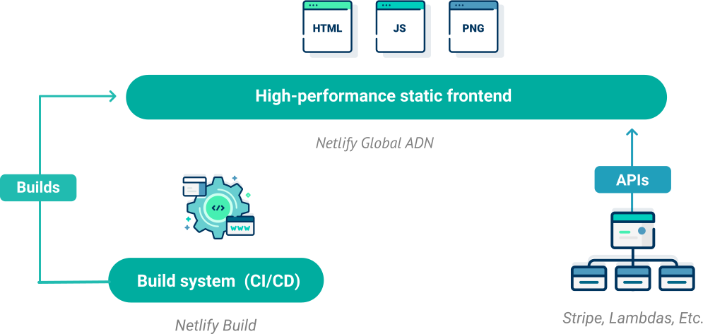

<!-- .slide: data-background="./images/akshar-dave-1GRvY9WUu08-unsplash.jpg" -->
<h1 class="title" style="text-align:left;">Serverless <span class="translucent">Functions +</span> Netlify</h1>
<h2 class="subtitle" style="color:#333;text-align:left;">Sia Karamalegos</h2>

---

## hi, i'm sia

[sia.codes](https://sia.codes/)


---

## [bit.ly/serverless-netlify](https://bit.ly/serverless-netlify)

---

## Show + Tell

Astronomic Birthdays 👩🏼‍🚀🚀🎂

[astrobirthday.netlify.app/](https://astrobirthday.netlify.app/)

Note: Show and demo site with. Point out that it's completely static with a serverless function - I securely request from an API with a key that cannot be snooped  , and to re-deploy I only push my code to Github.

---

## Serverless Architecture

&nbsp;

<div class="align-left">
  <p class="fragment fade-in-then-semi-out"><span class="icons"><i class="fas fa-function"></i></span> Applications are broken up into individual functions </p>
  <p class="fragment fade-in-then-semi-out"><span class="icons"><i class="far fa-cloud-upload-alt"></i></span> Hosted by a 3rd party service </p>
  <p class="fragment fade-in-then-semi-out"><span class="icons"><i class="far fa-chart-line"></i></span> Can be invoked and scaled individually </p>
  <p class="fragment fade-in-then-semi-out"><span class="icons"><i class="far fa-server"></i></span> No need for server management by the developer</p>
</div>

&nbsp;

<small>[Serverless Architecture](https://www.twilio.com/docs/glossary/what-is-serverless-architecture)</small>

---

<!-- .slide: data-background="./images/duotone-yell.jpg" class="dark-highlight-quote" -->

## Jamstack <!-- .element: class="dark-background" -->

> A modern web development architecture based on client-side JavaScript, reusable APIs, and prebuilt Markup <!-- .element: class="dark-background" -->

<small class="dark-background">— Mathias Biilmann (CEO & Co-founder of Netlify) [jamstack.wtf](https://jamstack.wtf/)</small>

---



<small>[www.netlify.com/jamstack/](https://www.netlify.com/jamstack/)</small>

Note: Step 1 is to decouple the frontend from the backend. The APIs can be from many sources - like a CMS, Stripe, Square, Auth0, FaunaDB, Hasura Cloud, etc.

---

## Prebuild static pages for speed

<div class="logo-grid">
  
  
  
  
  
  
</div>

Note: you can also use vanilla html, css, and javascript.

---

## Why I ♥️ Netlify

Note: Ask how many have used it - write in chat. Also write what your favorite feature is. My loves: it's just so freaking easy. Deploy with simple "git push" and can run code for builds so you don't have to do it locally first, shows old version if build fails, PR deploy previews, super easy basic forms, automatic HTTPS/SSL, CDN/edge deployments automatic, automatic Brotli compression. This is all before I started using it for serverless functions.

---

## Hello Web UI Netlify

&nbsp;

1. Make a repo on Github with a basic [index.html](https://gist.github.com/siakaramalegos/31197c13dd1110b34e715706232e392b) file.
2. Create a [Netlify](https://www.netlify.com/) account. It's free!
3. Link your Netlify account to Github and deploy your first website.

<span class="icons"><i class="fas fa-badge-check fa-3x"></i></span>

Note: Now we're going to put it on steroids to make it even more powerful.

---

<!-- .slide: data-background="./images/balloon-feet.jpg" -->

# Netlify CLI <!-- .element: style="color:#fff;" -->

Note: Netlify CLI lets us more easily build serverless functions in a dev environment and then port them to productions. We can also do other things like easily manage secrets between both environments.

---

```
$ npm install netlify-cli -g
$ netlify
$ netlify login
```

<small>[Get started with Netlify CLI](https://docs.netlify.com/cli/get-started/)</small>

Note: install, learn about the command, then login which opens up web auth. Do the above and explain the commands we will use - init, login, functions, env, dev.

---

```
Success! Netlify CLI has been installed!

Your device is now configured to use Netlify CLI to deploy and manage
your Netlify sites.

Next steps:

  netlify init     Connect or create a Netlify site from current
                   directory
  netlify deploy   Deploy the latest changes to your Netlify site

For more information on the CLI run netlify help
Or visit the docs at https://cli.netlify.com
```

Note: I don't usually use netlify deploy - I commit my code and push to Github instead.

---

## Hello, Netlify CLI!

1. **Fork** [the demo](https://github.com/siakaramalegos/serverless-netlify-demo) (don't clone!)
2. Clone **your** repo.
3. `cd serverless-netlify-demo`
4. `npm install`
5. `netlify init`

<small>Build command is `npm run build` and deploy directory is `_site`.</small>

<small>[bit.ly/yo-serverless](https://github.com/siakaramalegos/serverless-netlify-demo)</small>

---

## Hello, Netlify CLI!

Commit changes and push, then run `netlify open`.

# 🎉

---

<span class="icons"><i class="fas fa-badge-check fa-3x mr16"></i><i class="far fa-badge-check fa-3x"></i></span>

---

<!-- .slide: data-background="./images/bucography-r7eBv7pnP2E-unsplash.jpg" -->

# Environment<br> Variables <!-- .element: class="text-left color-secondary" -->

---

## Keeping secrets secret 🕵🏻‍♀️

1. Get an API key at [api.nasa.gov/](https://api.nasa.gov/)
2. Run `netlify open` to go to the Netlify UI
3. Save as `NASA_API_KEY` in **Build & Deploy** > **Environment**
4. Run `netlify dev` to confirm it gets injected for local dev

Note: you can set some env vars in your netlify.toml, but don't put secret ones there as that file must be checked into git.

---


---

<span class="icons"><i class="fas fa-badge-check fa-3x mr16"></i><i class="far fa-badge-check fa-3x mr16"></i><i class="fad fa-badge-check fa-3x"></i></span>

---

<!-- .slide: data-background="./images/duotone-babies.jpg" -->

# Serverless Functions <!-- .element: style="color:#fff;" -->

---

## Netlify Functions

<div class="align-left">
  <p class="fragment fade-in-then-semi-out"><span class="icons"><i class="fab fa-aws"></i></span> Uses AWS serverless Lambda under the hood</p>
  <p class="fragment fade-in-then-semi-out"><span class="icons"><i class="far fa-code-merge"></i></span> Version-controlled, built, and deployed with your site</p>
  <p class="fragment fade-in-then-semi-out"><span class="icons"><i class="far fa-binoculars"></i></span> Automatic service discovery (for Deploy Previews and rollbacks)</p>
  <p class="fragment fade-in-then-semi-out"><span class="icons"><i class="fab fa-js"></i></span> JavaScript and Go both supported</p>
</div>

<small>[Netlify functions overview](https://docs.netlify.com/functions/overview/)</small>

---

## <span class="icons"><i class="far fa-sack-dollar"></i></span> Free Tier <span class="icons"><i class="far fa-sack-dollar"></i></span>

- Receive up to 125K function endpoint requests per month
- Use up to 100 hours of function run time per month

<small>[Netlify Pricing](https://www.netlify.com/pricing/)</small>

---

## netlify.toml

```toml
[build]
  command = "npm run build"
  publish = "_site"
  functions = "functions"
```

<small>[File-based configuration](https://docs.netlify.com/configure-builds/file-based-configuration/)</small>

Note: First, we need to tell Netlify where to look for our functions. This will now sync our settings and point to where the functions can be found in our project.

---

<p class="text-left"><span class="icons"><i class="fas fa-pencil"></i></span> Write functions in <strong>/functions/hello.js</strong>.</p>
<p class="text-left"><span class="icons"><i class="far fa-code"></i></span> Access functions via <strong>/.netlify/functions/hello</strong>.</p>

---

## functions/hello.js

```javascript
// Must export a handler with this syntax:
exports.handler = async function(event, context) {

  // Return at least an HTTP status code to prevent timeouts:
  return {
    statusCode: 200,
    body: JSON.stringify({message: "Hello World"})
  };
}
```

<small>[Build serverless functions with JavaScript](https://docs.netlify.com/functions/build-with-javascript/)</small>

Note: we'll talk about what's in the event and contexto objects in a bit

---

## src/index.html

```html
<!-- At bottom of file: -->
<script>
  fetch('/.netlify/functions/hello')
    .then(response => response.json())
    .then(json => console.log({json}))
</script>
```

Note: restart netlify dev, then check console. In dev, function logs in your terminal. In prod, access them in the Netlify UI

---

```js
// What's in the event parameter?
{
    "path": "Path parameter",
    "httpMethod": "Incoming request's method name"
    "headers": {Incoming request headers}
    "queryStringParameters": {query string parameters }
    "body": "A JSON string of the request payload."
    "isBase64Encoded": "A boolean flag to indicate if the applicable
      request payload is Base64-encode"
}
```

Note: The context parameter includes information about the context in which the serverless function was called, like certain Identity user information, for example.

---

```javascript
// What you can return from your serverless function:
{
    "isBase64Encoded": true|false,
    "statusCode": httpStatusCode,
    "headers": { "headerName": "headerValue", ... },
    "multiValueHeaders": { "headerName": ["headerValue", "headerValue2", ...], ... },
    "body": "..."
}
```

---

<span class="icons"><i class="fas fa-badge-check fa-3x mr16"></i><i class="far fa-badge-check fa-3x mr16"></i><i class="fad fa-badge-check fa-3x mr16"></i><i class="fad fa-certificate fa-3x"></i></span>

---

<!-- .slide: data-background="./images/duotone-road.jpg" -->

# Bringing it all together <!-- .element: class="dark-background" -->

---

```
$ npm install node-fetch --save
```

```javascript
// functions/apod.js
const fetch = require("node-fetch")
```

Note: Node does not have fetch available in its api so we need to install it.

---

```html
<!-- index.html -->
<script>
  async function handleSubmit(e) {
    e.preventDefault()

    const formData = new FormData(e.target)
    const date = formData.get("date")

    fetch('/.netlify/functions/apod', {
      method: "POST",
      body: JSON.stringify({date})
    })
      .then()// ...
  }

  document.querySelector("#birthday-form").addEventListener("submit", handleSubmit)
</script>
```

<small>[FormData MDN docs](https://developer.mozilla.org/en-US/docs/Web/API/FormData), [Checking that fetch is successful](https://developer.mozilla.org/en-US/docs/Web/API/Fetch_API/Using_Fetch#Checking_that_the_fetch_was_successful)</small>

Note: Add form id, create submit handler, add event listener to form, move fetch inside handler, e.preventdefault, check works

---

```javascript
// functions/apod.js
exports.handler = async function(event, context) {
  const BASE_URL = "https://api.nasa.gov/planetary/apod"
  const {date} = JSON.parse(event.body)

  return fetch(`${BASE_URL}?api_key=${process.env.NASA_API_KEY}&date=${date}`)
    .then(response => {
      if (!response.ok) {
        throw new Error('Network response was not ok');
      }
      return response.json()
    })
    .then(data => {
      return {
        statusCode: 200,
        body: JSON.stringify(data)
      }
    })
    .catch(error => {
      return {
        statusCode: 500,
        body: JSON.stringify({error})
      }
    })
}
```

Note: form data on target, method post body stringify date, in function get date from const {date} = JSON.parse(event.body) and send back, check works

---

```javascript
// index.html
document.querySelector("#date-input").max = new Date().toLocaleDateString('en-CA')

function render(data) {
  const target = document.querySelector("#apods");
  target.innerHTML = ""
  const template = document.querySelector(".apod-template");

  const clone = template.content.cloneNode(true);
  clone.querySelector("img").src = data.url
  clone.querySelector("h2").innerText = data.title
  clone.querySelector(".explanation").innerText = data.explanation

  if (data.copyright) {
    clone.querySelector(".copyright").innerText = data.copyright
    clone.querySelector("small").classList.remove("hidden")
  }

  apods.appendChild(clone);
}
```

<small>[`<template>` MDN docs](https://developer.mozilla.org/en-US/docs/Web/HTML/Element/template)</small>

---

<!-- .slide: data-background="./images/duotone-small-hiss.jpg" -->
# 🎉<!-- .element: style="font-size:4em;" -->

---

<span class="icons"><i class="fas fa-badge-check fa-3x mr16"></i><i class="far fa-badge-check fa-3x mr16"></i><i class="fad fa-badge-check fa-3x mr16"></i><i class="fad fa-certificate fa-3x mr16"></i><i class="fal fa-badge-sheriff fa-3x"></i></span>

---

<!-- .slide: data-background="./images/adi-goldstein-Hli3R6LKibo-unsplash.jpg" -->

# User Auth <!-- .element: class="dark-highlighter" style="color:hsl(347, 86%, 89%, 1);" -->

Note: Let's see how to use Netlify Identity inside a serverless function by accessing the context object.

---

## Enable Netlify Identity

1. `netlify open`
2. Go to the Identity tab
3. Click **Enable Identity**

<small>[Netlify Identity docs](https://www.netlify.com/docs/identity), Free tier includes a 1,000 active user limit</small>

---

## Set up the widget

```html
<!-- src/_includes/layout.njk -->

<div data-netlify-identity-button></div>

<script type="text/javascript"
  src="https://identity.netlify.com/v1/netlify-identity-widget.js">
</script>
```

<small>[Netlify Identity Widget](https://github.com/netlify/netlify-identity-widget)</small>

Note: Give it your prod URL, on first use in dev mode. Make sure the script is above where the rest of the content is dumped from the templates.

---

```javascript
// profile.html

function handleIdentityEvent(user) {
    if (user && user.token) {
      console.log({user});
      document.querySelector("#email").innerText = user.email
      return
    }

    window.location.pathname = '/'
  }

  window.netlifyIdentity.on('init', handleIdentityEvent)
  window.netlifyIdentity.on('logout', handleIdentityEvent)
}
```

---

## Accessing the user in serverless functions

1. Add the user token to the Auth header:

```javascript
// index.html

const { access_token } = window.netlifyIdentity.currentUser().token

fetch('/.netlify/functions/apod', {
  method: "POST",
  headers: {
    Authorization: `Bearer ${access_token}`,
  },
  body: JSON.stringify({date})
})
```

---

## Access the user in our function via `context`

```javascript
// functions/apod.js
exports.handler = async function(event, context) {
  const { user } = context.clientContext
  console.log(user);

  // Example login and role check:
  const isLoggedIn = user && user.app_metadata
  const roles = user.app_metadata.roles || []

  if (!isLoggedIn || !roles.includes('admin')) {
    return {
      statusCode: 401,
      body: 'Unauthorized',
    }
  }
```

---

<span class="icons"><i class="fas fa-badge-check fa-3x mr16"></i><i class="far fa-badge-check fa-3x mr16"></i><i class="fad fa-badge-check fa-3x mr16"></i><i class="fad fa-certificate fa-3x mr16"></i><i class="fal fa-badge-sheriff fa-3x mr16"></i><i class="fad fa-badger-honey fa-3x"></i></span>

---

<!-- .slide: data-background="./images/akshar-dave-1GRvY9WUu08-unsplash.jpg" -->
<h1 class="title" style="text-align:left;">Thanks!</h1>

<p style="color:#333;text-align:left;">Slides:<br> <a href="https://bit.ly/serverless-netlify" class="link-secondary">bit.ly/serverless-netlify</a></p>
<p style="color:#333;text-align:left;">Demo:<br> <a href="https://github.com/siakaramalegos/serverless-netlify-demo" class="link-secondary">bit.ly/yo-serverless</a></p>
<p style="color:#333;text-align:left;">Writing, resources, and more:<br> <a href="https://sia.codes/" class="link-secondary">sia.codes</a></p>

---

## Photo credits

- Road possum - Image by <a href="https://pixabay.com/users/csbonawitz-10920947/?utm_source=link-attribution&amp;utm_medium=referral&amp;utm_campaign=image&amp;utm_content=3861107">csbonawitz</a> from <a href="https://pixabay.com/?utm_source=link-attribution&amp;utm_medium=referral&amp;utm_campaign=image&amp;utm_content=3861107">Pixabay</a>
- Hissing possum - Image by <a href="https://pixabay.com/users/xandepontes-13842118/?utm_source=link-attribution&amp;utm_medium=referral&amp;utm_campaign=image&amp;utm_content=4787791">Alexandre Pontes Gomes xande</a> from <a href="https://pixabay.com/?utm_source=link-attribution&amp;utm_medium=referral&amp;utm_campaign=image&amp;utm_content=4787791">Pixabay</a>
- Snow possum - [University of Texas biodiversity blog](https://biodiversity.utexas.edu/news/entry/campus-biodiversity-awesome-opossums)
- Possum with babies - [Wikimedia Commons](https://commons.wikimedia.org/wiki/File:Didelphis_virginiana_with_young.JPG)
- Balloons <span>Photo by <a href="https://unsplash.com/@buco_balkanessi?utm_source=unsplash&amp;utm_medium=referral&amp;utm_content=creditCopyText">Bucography</a> on <a href="https://unsplash.com/?utm_source=unsplash&amp;utm_medium=referral&amp;utm_content=creditCopyText">Unsplash</a></span>
- Heart balloons <span>Photo by <a href="https://unsplash.com/@akshar_dave?utm_source=unsplash&amp;utm_medium=referral&amp;utm_content=creditCopyText">Akshar Dave</a> on <a href="https://unsplash.com/?utm_source=unsplash&amp;utm_medium=referral&amp;utm_content=creditCopyText">Unsplash</a></span>
- Balloon and feet dangling - <span>Photo by <a href="https://unsplash.com/@edrecestansberry?utm_source=unsplash&amp;utm_medium=referral&amp;utm_content=creditCopyText">Edrece Stansberry</a> on <a href="https://unsplash.com/?utm_source=unsplash&amp;utm_medium=referral&amp;utm_content=creditCopyText">Unsplash</a></span>
- Possum yelling [tweet](https://twitter.com/PossumEveryHour/status/1325951348291072000)   by [@PossumEveryHour](https://twitter.com/PossumEveryHour)
- Ballons with ribbons <span>Photo by <a href="https://unsplash.com/@adigold1?utm_source=unsplash&amp;utm_medium=referral&amp;utm_content=creditCopyText">Adi Goldstein</a> on <a href="https://unsplash.com/s/photos/balloons?utm_source=unsplash&amp;utm_medium=referral&amp;utm_content=creditCopyText">Unsplash</a></span>
