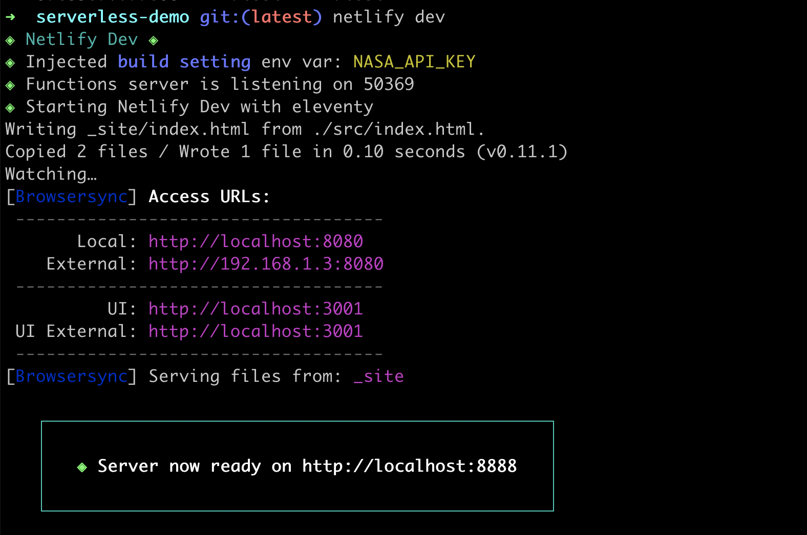

## Hello, Netlify

1. Make a repo on Github with a basic [index.html](https://gist.github.com/siakaramalegos/31197c13dd1110b34e715706232e392b) file.
2. Create a [Netlify](https://www.netlify.com/) account. It's free!
3. Link your Netlify account to Github and deploy your first website.

# NETLIFY CLI SLIDE

```
$ npm install netlify-cli -g
$ netlify
$ netlify login
```

Note: install, learn about the command, then login which opens up web auth. Do the above and explain the commands we will use - init, login, functions, env, dev.

```
Success! Netlify CLI has been installed!

Your device is now configured to use Netlify CLI to deploy and manage
your Netlify sites.

Next steps:

  netlify init     Connect or create a Netlify site from current
                   directory
  netlify deploy   Deploy the latest changes to your Netlify site

For more information on the CLI run netlify help
Or visit the docs at https://cli.netlify.com
```

Note: I don't usually use netlify deploy - I commit my code and push to Github instead.

## Hello, Netlify CLI!

1. **Fork** [the demo](https://github.com/siakaramalegos/serverless-netlify-demo) (don't clone!)
2. Clone **your** repo.
3. `cd serverless-netlify-demo`
4. `npm install`
5. `netlify init`:  Build command is `npm run build` and deploy directory is `_site`
6.  run `netlify open`

# ENV VAR SLIDE

## Keeping secrets secret 🕵🏻‍♀️

1. Get an API key at [api.nasa.gov/](https://api.nasa.gov/)
2. Run `netlify open` to go to the Netlify UI
3. Save as `NASA_API_KEY` in **Build & Deploy** > **Environment**
4. Run `netlify dev` to confirm it gets injected for local dev

Note: you can set some env vars in your netlify.toml, but don't put secret ones there as that file must be checked into git.



# FUNCTIONS SLIDES

## netlify.toml

```toml
[build]
  command = "npm run build"
  publish = "_site"
  functions = "functions"
```

## functions/hello.js

```javascript
// Must export a handler with this syntax:
exports.handler = async function(event, context) {

  // Return at least an HTTP status code to prevent timeouts:
  return {
    statusCode: 200,
    body: JSON.stringify({message: "Hello World"})
  };
}
```

<small>[Build serverless functions with JavaScript](https://docs.netlify.com/functions/build-with-javascript/)</small>

Note: we'll talk about what's in the event and context objects in a bit

## src/index.html

```html
<!-- At bottom of file: -->
<script>
  fetch('/.netlify/functions/hello')
    .then(response => response.json())
    .then(json => console.log({json}))
</script>
```

Note: restart netlify dev, then check console. In dev, function logs in your terminal. In prod, access them in the Netlify UI

# WHAT'S IN THE EVENT PARAMETER SLIDES

# BRING IT ALL TOGETHER

```
$ npm install node-fetch --save
```

```javascript
// functions/apod.js
const fetch = require("node-fetch")
```

Note: Node does not have fetch available in its api so we need to install it.

```html
<!-- index.html -->
<script>
  async function handleSubmit(e) {
    e.preventDefault()

    const formData = new FormData(e.target)
    const date = formData.get("date")

    fetch('/.netlify/functions/apod', {
      method: "POST",
      body: JSON.stringify({date})
    })
      .then()// ...
  }

  document.querySelector("#birthday-form").addEventListener("submit", handleSubmit)
</script>
```

<small>[FormData MDN docs](https://developer.mozilla.org/en-US/docs/Web/API/FormData), [Checking that fetch is successful](https://developer.mozilla.org/en-US/docs/Web/API/Fetch_API/Using_Fetch#Checking_that_the_fetch_was_successful)</small>

Note: Add form id, create submit handler, add event listener to form, move fetch inside handler, e.preventdefault, check works

```javascript
// functions/apod.js
exports.handler = async function(event, context) {
  const BASE_URL = "https://api.nasa.gov/planetary/apod"
  const {date} = JSON.parse(event.body)

  return fetch(`${BASE_URL}?api_key=${process.env.NASA_API_KEY}&date=${date}`)
    .then(response => {
      if (!response.ok) {
        throw new Error('Network response was not ok');
      }
      return response.json()
    })
    .then(data => {
      return {
        statusCode: 200,
        body: JSON.stringify(data)
      }
    })
    .catch(error => {
      return {
        statusCode: 500,
        body: JSON.stringify({error})
      }
    })
}
```

Note: form data on target, method post body stringify date, in function get date from const {date} = JSON.parse(event.body) and send back, check works


```javascript
// index.html
document.querySelector("#date-input").max = new Date().toLocaleDateString('en-CA')

function render(data) {
  const target = document.querySelector("#apods");
  target.innerHTML = ""
  const template = document.querySelector(".apod-template");

  const clone = template.content.cloneNode(true);
  clone.querySelector("img").src = data.url
  clone.querySelector("h2").innerText = data.title
  clone.querySelector(".explanation").innerText = data.explanation

  if (data.copyright) {
    clone.querySelector(".copyright").innerText = data.copyright
    clone.querySelector("small").classList.remove("hidden")
  }

  apods.appendChild(clone);
}
```

<small>[`<template>` MDN docs](https://developer.mozilla.org/en-US/docs/Web/HTML/Element/template)</small>

